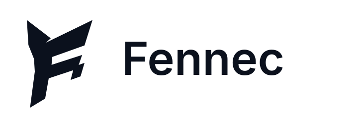

# Fennec

<picture>
  <source media="(prefers-color-scheme: dark)" srcset="public/assets/brand/fennec-a-lockup-primary.svg">
  
</picture>

Fennec is a local-first Rocket League match journal and live dashboard. It
turns the games you play into a useful personal history: what happened in each
match, how a play session went, where you interacted with the ball, and which
players you keep meeting.

Fennec runs at [app.fennec.gg](https://app.fennec.gg) on the same Windows PC as
Rocket League. Chromium-based desktop browsers are currently tested and
supported. Other browser engines are not yet part of Fennec's compatibility
test matrix.

There is no Fennec account to create, no Fennec software to install, and no
match history uploaded to a Fennec service. The browser connects directly to
Rocket League's local Stats API and keeps the resulting history on your device.

## Why Fennec exists

Rank and MMR summarize where you are on a ladder. They do not preserve much of
the story of the games that got you there.

Fennec is for remembering and understanding your own play. It combines the
scoreboard and event data exposed by Rocket League with context derived across
matches: passes, 50s, automatic sessions, recurring teammates, opponent
history, ball interaction analytics, and a three-dimensional touch map. The
result is a record of actual games rather than another public rank lookup.

## What Fennec shows you

### Every game, live and after it ends

During a match, Fennec provides a dedicated live view with the clock, score,
teams, player statistics, ball analytics, and a readable event timeline. After
the match, the same view becomes part of your durable local history.

The scoreboard includes score, goals, assists, saves, shots, touches, demos,
passes, and 50s. Rocket League supplies the underlying match and event data;
Fennec derives passes and 50s from the order and identity of observed ball
touches. This keeps those extra statistics tied to a consistent, inspectable
definition instead of pretending the game reports values that it does not.

### Play sessions instead of isolated results

Nearby games are automatically grouped into sessions. A session shows your
record, win rate, current streak, goal difference, scoring totals, average
score, touches, demos, passes, 50s, and recurring teammates. You can adjust the
idle gap or end a session manually when one stretch of play is finished.

### Ball analytics and touch maps

Fennec records normal-play ball telemetry and turns it into player-relative
analytics such as:

- ball hits and team touch share;
- average and fastest post-hit speed;
- speed gained or lost on a hit;
- observed ball speed and last-touch control; and
- the locations of touches, 50s, saves, and scoring touches.

The interactive 3D touch map adapts to Soccar, Hoops, Dropshot, and unknown
arena shapes. It can be explored by player, team, opponent, or all players.

### History with other players

Players in captured matches accumulate context. Fennec can show the games in
which a player appeared, when you were teammates or opponents, and the results
of those encounters. Recurring teammates are surfaced automatically in session
summaries.

This is private encounter history built from games stored in your browser. It
is not a global player search, and it cannot show games that Fennec did not
observe.

## What Fennec is not

Fennec does not provide rank, division, MMR, account progression, or a player's
complete platform history. Rocket League's local Stats API describes a match
while it is happening; it does not expose those account-level systems.

That boundary defines the product rather than leaving it incomplete. Fennec is
focused on the detailed game, session, player, event, and ball data that can be
observed locally. Its future direction is to make that context more useful and
more understandable while keeping the data local and the derived statistics
explainable.

Normal play is the source of durable history. Training can appear in the live
view but is not saved or exported. Fennec does not depend on spectator-only
telemetry, and unavailable data is shown as unavailable rather than estimated.

## Start without installing anything

1. Open [app.fennec.gg](https://app.fennec.gg) in a supported desktop browser
   on the same Windows PC as Rocket League.
2. Allow local network access if the browser asks. This lets the site connect
   to Rocket League on the same computer; it does not send your local history
   elsewhere.
3. Open **Setup**, choose **Browser only**, and follow the instructions to
   enable Rocket League's Stats API. Rocket League must be restarted after its
   configuration changes.
4. Start Rocket League and return to Setup to verify the live feed.
5. Choose your player in **Profile** so Fennec can present teams, scores,
   sessions, and history from your point of view.

Keep the Fennec tab or installed browser app open while you play. A compatible
Chromium-based browser can install Fennec as a Progressive Web App for a
dedicated window and offline application shell. Installation is optional; the
complete Fennec experience is available in a normal browser tab.

The in-app Setup center remains the source of truth for configuration and can
be revisited at any time. The official protocol and manual configuration are
documented in the
[Rocket League Stats API guide](https://www.rocketleague.com/developer/stats-api).

## Optional Windows companion

The Fennec Companion is an optional add-on, not a requirement. Browser-only
capture provides the complete dashboard and history experience.

The companion is useful when you want Fennec to work more automatically. It can
run quietly in the Windows tray, configure detected Steam and Epic
installations, capture while the browser is closed, and synchronize collected
frames with a paired browser. It can start with Windows or through an optional
Rocket League shortcut, and opening the dashboard with the game remains
opt-in.

[Download the latest Windows companion](https://github.com/ryanf9802/Fennec/releases/latest/download/Fennec-Companion-Windows-x64-setup.exe),
then open Fennec's Setup page to pair it. Signed updates are downloaded in the
background and installed after Rocket League capture is idle.

## Your data stays local

Fennec stores match summaries, sessions, player appearances, relationships,
compact events, preferences, and profile selection in the current browser's
IndexedDB database. Compact history and analytics are retained; full technical
event payloads are kept for 90 days.

Each browser origin has separate storage. In particular,
`http://localhost:5173` and `https://app.fennec.gg` do not share a database. Use
Settings to export and restore a versioned backup when moving history between
origins or browsers. Fennec also exports selected-player match summaries as
CSV.

Browser storage is still local application data: clearing site data or losing
the device can remove it. Use backups for history you want to keep.

## Technical overview

Fennec is a React and TypeScript browser application built with Vite. It reads
the local WebSocket Stats API through an adapter, reduces packets into a shared
match model, and persists versioned history through a storage-neutral
repository backed by Dexie and IndexedDB. The optional Tauri companion uses a
durable SQLite journal for browser handoff.

The application is tested with Vitest and Playwright and deployed to private S3
storage behind CloudFront through TypeScript CDK. The companion is a Rust/Tauri
Windows application distributed through signed GitHub releases.

- [Development guide](docs/development.md)
- [Deployment and release guide](docs/deployment.md)
- [Brand assets](public/assets/brand/README.md)

## License

Fennec is available under the [MIT License](LICENSE). Third-party components
remain subject to their own licenses; see
[THIRD-PARTY-NOTICES.md](THIRD-PARTY-NOTICES.md).

Rocket League and related names are trademarks of their respective owners.
Fennec is an independent community project and is not endorsed by Psyonix or
Epic Games.
